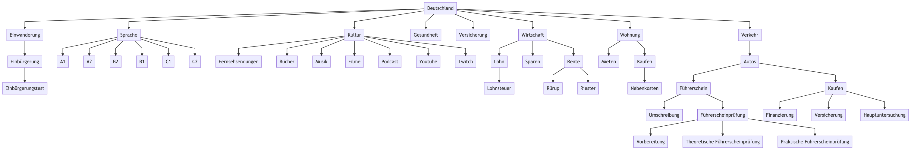

# 🇩🇪 Deutschland

* Einwanderung
  * Einbürgerung
    * [Einbürgerung in Deutschland - BAMF](https://www.bamf.de/DE/Themen/Integration/ZugewanderteTeilnehmende/Einbuergerung/einbuergerung-node.html;jsessionid=791DC7FE6DCC3C88A41030D4902BFEB4.internet531)
      * Einbürgerungstest

* Sprache
  * [GER - Gemeinsamer Europäischer Referenzrahmen für Sprachen](https://www.europaeischer-referenzrahmen.de)
  * A1 – Anfänger
  * A2 – Grundlegende Kenntnisse
  * B1 – Fortgeschrittene Sprachverwendung
  * B2 – Selbständige Sprachverwendung
  * C1 – Fachkundige Sprachkenntnisse
  * C2 – Annähernd muttersprachliche Kenntnisse

* Kultur
  * Fernsehsendungen
    * A1/A2
      * Türkisch für Anfänger
        * [Netflix](https://www.netflix.com/watch/80125201)
        * [IMDb](https://www.imdb.com/title/tt0469009/)
    * B1
    * B2/C1
  * Bücher
    * A1/A2
    * B1
    * B2/C1
      * [Nullzeit - Juli Zeh](https://www.amazon.de/Nullzeit-Roman-Juli-Zeh/dp/3442745691/ref=asc_df_3442745691/)
  * Musik
  * Filme
  * Podcast
  * YouTube
  * Twitch

* Gesundheit
  * Krankenversicherung
    * Sehen Sie sich die Rubrik "Versicherung > Krankenversicherung" an

* Versicherung
  * Krankenversicherung
    * [Private oder Gesetzliche Krankenversicherung: Was lohnt sich eher?](https://www.youtube.com/watch?v=3jNJHsw30_s)
    * [Private vs Gesetzliche Krankenversicherung](https://www.youtube.com/watch?v=4LdbbPm_31c)

* Wirstschaft
  * Lohn
    * Beruf
      * [Gehaltsreport 2021: Die bestbezahlten Berufe und Branchen in Deutschland!](https://www.youtube.com/watch?v=qggzwdO9k_o)
    * Lohnsteuer
  * Sparen
    * Festgeld
    * Tagesgeld
  * Rente
    * Rürup
    * Riester

* Wohnung
  * Mieten
  * Kaufen
    * [Kaufen oder Mieten: Was lohnt sich eher?](https://www.youtube.com/watch?v=pEMudWHiXh0)
    * Nebenkosten

* Verkehr
  * Autos
    * Führerschein
      * Führerscheinprüfung
        * Vorbereitung
        * Theoretische Führerscheinprüfung
        * Praktische Führerscheinprüfung
      * Umschreibung

    * Kaufen
      * Hauptuntersuchung
        * [Ab wann zur Abgasuntersuchung mit Pkw, Motorrad oder Oldtimer?](https://www.bussgeldkatalog.org/abgasuntersuchung-ab-wann/)
      * Versicherung
      * Finanzierung
