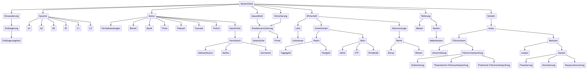

# 🇩🇪 Deutschland

* Einwanderung
  * Einbürgerung
    * [Einbürgerung in Deutschland - BAMF](https://www.bamf.de/DE/Themen/Integration/ZugewanderteTeilnehmende/Einbuergerung/einbuergerung-node.html;jsessionid=791DC7FE6DCC3C88A41030D4902BFEB4.internet531)
      * Einbürgerungstest

* Sprache
  * [GER - Gemeinsamer Europäischer Referenzrahmen für Sprachen](https://www.europaeischer-referenzrahmen.de)
  * A1 – Anfänger
  * A2 – Grundlegende Kenntnisse
  * B1 – Fortgeschrittene Sprachverwendung
  * B2 – Selbständige Sprachverwendung
  * C1 – Fachkundige Sprachkenntnisse
  * C2 – Annähernd muttersprachliche Kenntnisse

* Kultur
  * Fernsehsendungen
    * A1/A2
      * Türkisch für Anfänger | [Netflix](https://www.netflix.com/watch/80125201) | [IMDb](https://www.imdb.com/title/tt0469009/)
    * B1
      * Barbaren | [Trailer](https://www.youtube.com/watch?v=uX_qzfJyeT0) | [Netflix](https://www.netflix.com/title/81024039) | [IMDb](https://www.imdb.com/title/tt9184986/)
      * Dogs of Berlin | [Trailer](https://www.youtube.com/watch?v=bk4yo3nWvqM) | [Netflix](https://www.netflix.com/title/80189522) | [IMDb](https://www.imdb.com/title/tt6839788/)
      * Wir sind die Welle | [Trailer](https://www.youtube.com/watch?v=ZBMUaSB2g8o) | [Netflix](https://www.netflix.com/title/80218819) | [IMDb](https://www.imdb.com/title/tt11053220/)
      * Morgen hör ich auf | [Trailer](https://www.youtube.com/watch?v=1WJDvTUZ5HU) | [ZDF](https://www.zdf.de/serien/morgen-hoer-ich-auf) | [IMDb](https://www.imdb.com/title/tt4368698/)
    * B2/C1+
      * Kleo | [Netflix](https://www.netflix.com/de/title/81216677) | [IMDb](https://www.imdb.com/title/tt15135104/)
      * Tatort | [ARD](https://www.ardmediathek.de/tatort?xtor=CS1-249-[g]-[tatort]-[aon-f]-[v2]&gclid=EAIaIQobChMIwPDu5Y24-gIVh47ICh1adwumEAAYASAAEgJBavD_BwE) | [IMDb](https://www.imdb.com/title/tt0806910/)
      * Criminal: Deutschland | [Trailer](https://www.youtube.com/watch?v=OTKPV5z48ck) | [Netflix](https://www.netflix.com/title/81020518) | [IMDb](https://www.imdb.com/title/tt10986056/)
      * Betonrausch - Rising High | [Trailer](https://www.youtube.com/watch?v=3aY6_O1CWn0) | [Netflix](https://www.netflix.com/title/81058432) | [IMDb](https://www.imdb.com/title/tt9806336/)
  * Bücher
    * A1/A2
    * B1
    * B2/C1
      * [Nullzeit - Juli Zeh](https://www.amazon.de/Nullzeit-Roman-Juli-Zeh/dp/3442745691/ref=asc_df_3442745691/)
  * Musik
  * Filme
  * Podcast
  * YouTube
    * Geschichte
      * [MrWissen2goGeschichte](https://www.youtube.com/c/MrWissen2goGeschichte)
    * Lustig
      *
  * Twitch
  * Geschichte
    * Vorromischen
      * Hallstattkultur
        * [Die Anfang bis Hallstattkultur - Zusammenfassung](https://docs.google.com/document/d/1trANmiJ02SeRNKMN93XT15Q_BWdy9G7Bvc6i3k_9GNU)
      * Die Kelten
        * [Die Kelten - Zusammenfassung](https://docs.google.com/document/d/12gHfHdf1LOZT6H4d6nbyzRQPBwdF9XzbQ2d9UUA3ofM)
        * [Mythos Kelten – so waren sie wirklich](https://www.youtube.com/watch?v=CQhtKeUHW-c)
        * [Wer waren die Kelten? - Welt der Wunder](https://www.youtube.com/watch?v=61Obzzfh1Fc)
        * [Wie lebten die Kelten? | Planet Schule](https://www.youtube.com/watch?v=7ZT-LSgZLso)
      * Die Germanen
        * [Die Germanen - Zusammenfassung](https://docs.google.com/document/d/12gHfHdf1LOZT6H4d6nbyzRQPBwdF9XzbQ2d9UUA3ofM)
        * [Die Geschichte der Germanen](https://www.youtube.com/watch?v=5y7Gf7iwF90)

* Gesundheit
  * Krankenversicherung
    * Sehen Sie sich die Rubrik "Versicherung > Krankenversicherung" an

* Versicherung
  * Krankenversicherung
    * [Private oder Gesetzliche Krankenversicherung: Was lohnt sich eher?](https://www.youtube.com/watch?v=3jNJHsw30_s)
    * [Private vs Gesetzliche Krankenversicherung](https://www.youtube.com/watch?v=4LdbbPm_31c)

* Wirstschaft
  * Lohn
    * Beruf
      * [Gehaltsreport 2021: Die bestbezahlten Berufe und Branchen in Deutschland!](https://www.youtube.com/watch?v=qggzwdO9k_o)
    * Schicht
      * [Zu welcher Schicht gehörst Du?](https://www.youtube.com/watch?v=JzhnUWUigJQ)
    * Lohnsteuer
  * Altersvorsorge
    * Rente
      * Rürup
        * [Rürup-Rente: Unter welchen Bedingungen sie (keinen) Sinn mach](https://www.youtube.com/watch?v=q26XY1-rSaQ)
        * [Rürup Rente: Für wen lohnt es sich? Vor- & Nachteile!](https://www.youtube.com/watch?v=ZCyOUvS3NJs)
        * [Basisrente (Rürup) vs Riesterrente | Vor- und Nachteile](https://www.youtube.com/watch?v=ABwTofeDmRE)
      * Riester
        * [Riester-Rente einfach erklärt: Welche Anlage-Möglichkeiten gibt es?](https://www.youtube.com/watch?v=4Y2Be_DilrA)
  * Investitionen
    * [10.000€ in 10 Jahren - Aktien, ETF, Bitcoin, Gold, Tagesgeld, MSCI World](https://www.youtube.com/watch?v=sqysmr22gcc)
    * Passiv
      * [Tagesgeldkonto und Festgeld einfach erklärt!](https://www.youtube.com/watch?v=9EC1PffrXVI)
      * Tagesgeld
        * [Was ist ein Tagesgeldkonto?](https://www.youtube.com/watch?v=g60FwLgdqI4)
      * Festgeld
    * Aktive
      * Aktien
      * ETF
      * Dividende
        * [Kritik an der Dividendenstrategie?](https://www.youtube.com/watch?v=4ePuuLqn-oY)
* Wohnung
  * Mieten
  * Kaufen
    * [Kaufen oder Mieten: Was lohnt sich eher?](https://www.youtube.com/watch?v=pEMudWHiXh0)
    * Nebenkosten

* Verkehr
  * Autos
    * Führerschein
      * Führerscheinprüfung
        * Vorbereitung
        * Theoretische Führerscheinprüfung
        * Praktische Führerscheinprüfung
      * Umschreibung
    * Leasen
      * [Auto Leasen oder Kaufen: Was ist besser?](https://www.youtube.com/watch?v=suSivGcUitA)
    * Kaufen
      * Hauptuntersuchung
        * [Ab wann zur Abgasuntersuchung mit Pkw, Motorrad oder Oldtimer?](https://www.bussgeldkatalog.org/abgasuntersuchung-ab-wann/)
      * Versicherung
      * Finanzierung
